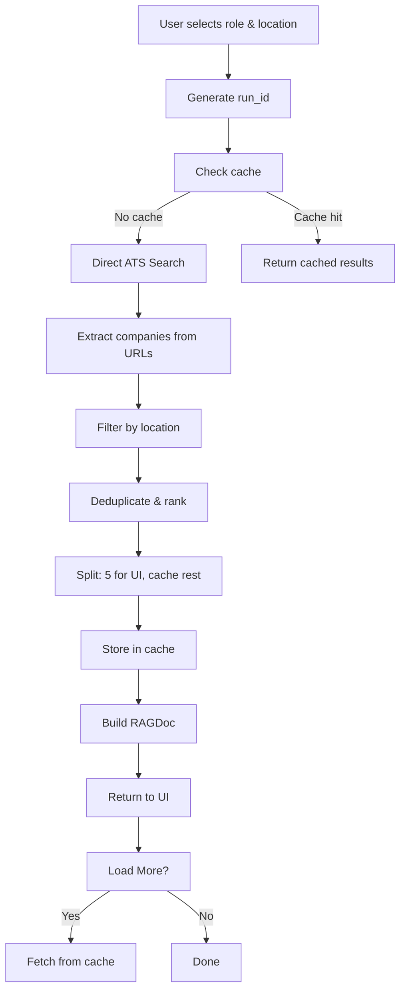

# Job Search Flow - Complete Engineering Understanding

## Overview
This document explains the complete job search pipeline, caching mechanism, and data flow in your project.

## 1. Initial Setup & Role Selection

```yaml
# From data/seeds/roles.yaml
Machine Learning Engineer:
  keywords: ["Python", "PyTorch", "TensorFlow", "MLOps", ...]
  value_props: ["deploying ML models to production", ...]
  hooks: ["production ML", "scalable inference", ...]
  proofs: ["deployed recommender system serving 1M users", ...]
```

**What happens:**
1. All 15 roles are loaded from `roles.yaml` into memory
2. User selects a role (e.g., "Machine Learning Engineer") and location (e.g., "San Francisco")
3. A unique `run_id` is generated (e.g., `e85eaded-52bc-49f5-8309-5ff5f1ffd283`)

## 2. The Search Pipeline

### Phase 0: Direct ATS Search
```
📥 Got 7 raw hits from: site:greenhouse.io "Machine Learning Engineer" "San Fra..."
✅ Valid company name: Scaleai
✅ 📍 Local: Scaleai - Machine Learning Engineer...
```

**What's happening:**
- `smart_search()` is called with Tavily API
- Queries are constructed for specific ATS platforms:
  - `site:greenhouse.io "Machine Learning Engineer" "San Francisco" jobs`
  - `site:lever.co "Machine Learning Engineer" "San Francisco" jobs`
  - `site:ashbyhq.com "Machine Learning Engineer" "San Francisco" jobs`
- Each query returns up to 8 raw hits
- `extract_company_and_title_from_url()` extracts company names from URLs
- Invalid companies are filtered out

**Why some URLs have "No company extracted":**
```
⏭️ No company extracted from: https://jobs.lever.co/osaro...
⏭️ No company extracted from: https://jobs.lever.co/inkitt/4d2c7e0c-1f28-44e5-a6...
```
These are likely:
- Homepage URLs (not job postings)
- URLs with malformed structure
- URLs from subdomains like `jobs.lever.co` without a company subdomain

**Professional solution:** Companies maintain consistent URL patterns and proper sitemaps.

### Phase 1: Results Aggregation
```
📊 Location search: 17 local, 2 remote
📊 Final results: 17 total (17 local, 2 remote)
```

**Process:**
1. All results from different ATS platforms are combined
2. Deduplicated by company name
3. Sorted by: local jobs first, then remote, then by score
4. Location matching is performed using `matches_location()`

### Phase 2: Batching & Caching
```
📋 First batch: 5 results (5 local, 0 remote)
💾 Cached 12 results for Load More (key=loadmore:e85eaded-52bc-49f5-8309-5ff5f1ffd283)
```

**What this means:**
- First 5 results are sent to UI for immediate display
- Remaining 12 are cached for "Load More" functionality
- Cache key format: `loadmore:{run_id}`

## 3. Caching System Deep Dive

### What is cached?
```
📋 get_rag_results: Found cached data for e85eaded-52bc-49f5-8309-5ff5f1ffd283, type=<class 'dict'>
📋 Cached dict has 10 companies, keys: ['run_id', 'role', 'location', 'depth', 'companies', 'total', 'pagination', 'resume_insights', 'resume_excerpt', 'searched_roles']
```

**Cache structure:**
```python
{
    "run_id": "e85eaded-52bc-49f5-8309-5ff5f1ffd283",
    "role": "Machine Learning Engineer",
    "location": "San Francisco",
    "depth": "standard",
    "companies": [...],  # List of company objects
    "total": 10,
    "pagination": {...},
    "resume_insights": {...},
    "resume_excerpt": "...",
    "searched_roles": ["Machine Learning Engineer"]
}
```

### Where is it cached?
- **In-memory cache** using `Memory()` class (from `memory/state_store.py`)
- **Cache key:** `ragdoc:{run_id}` for main results
- **Load More key:** `loadmore:{run_id}` for additional results
- **Storage:** Lives in application memory, cleared on restart

### Cache behavior:
1. **First search:** No cache → performs search → stores results
2. **Second search (same role/location):** Cache hit → returns cached results immediately
3. **Different role/location:** New `run_id` → performs new search

**Getting fresh results:**
- Cache is tied to `run_id`
- New search = new `run_id` = fresh results
- No manual cache invalidation needed

## 4. Role Profile & Variations

```
🎯 Role profile for 'Machine Learning Engineer': 9 keywords, 4 value props
```

**Source:** `roles.yaml`
```yaml
Machine Learning Engineer:
  keywords: ["Python", "PyTorch", "TensorFlow", "MLOps", ...]  # 9 total
  value_props: ["deploying ML models to production", ...]     # 4 total
```

### Role Variations
```
📋 Next roles batch: ['AI Engineer', 'ML Engineer', 'AI/ML Engineer', 'Applied Scientist', 'Research Scientist']
```

**How it works:**
1. System intelligently generates variations of the selected role
2. These are NOT from a file - generated by `role_profile()` function
3. Used for "Load 5 more roles" feature to find similar positions

## 5. RAGDoc Construction

```
✅ get_rag_results: Successfully built RAGDoc with 10 companies
```

**RAGDoc** is a Pydantic model that structures the search results:
```python
class RAGDoc(BaseModel):
    run_id: str
    role: str
    location: str
    companies: List[Dict]  # Final filtered companies
    total: int
    pagination: Dict
    resume_insights: Dict
    resume_excerpt: str
    searched_roles: List[str]
```

**Why 10 companies from 17 results?**
- Initial search found 17 companies
- After filtering, deduplication, and ranking → 10 high-quality matches
- Filtering criteria:
  - Valid company names
  - Location match
  - ATS domain quality
  - Score ranking

## 6. The 5 Repeated API Calls Mystery

```
🔍 get_rag_results called: run_id=e85eaded-52bc-49f5-8309-5ff5f1ffd283, cached_data=False
⚠️ get_rag_results: No cached data found for e85eaded-52bc-49f5-8309-5ff5f1ffd283
```

**Why 5 times?**
1. UI polls for results while search is running
2. Each poll = 1 API call to `/results/{run_id}`
3. Until search completes, `cached_data=False`
4. After search completes, subsequent polls get `cached_data=True`

**Effect on results:**
- No negative effect - just polling mechanism
- Prevents UI from showing stale data
- Normal behavior for async operations

## 7. Artifacts

```
⚠️ /results/e85eaded-52bc-49f5-8309-5ff5f1ffd283: No artifacts found or artifacts is not a dict
```

**Artifacts are:**
- Additional metadata or files related to the search
- Currently not implemented in your system
- Warning can be ignored - doesn't affect functionality

## 8. Complete Flow Summary



## 9. Key Components & Files

- **`rag_companies.py`**: Main search logic
- **`roles.yaml`**: Role definitions with keywords/value props
- **`memory/state_store.py`**: In-memory caching
- **`job_search.py`**: URL processing and filtering utilities

## 10. Professional Companies' Approach

1. **Consistent URL structures**: Always use `company.ats.com/job/123`
2. **Proper sitemaps**: XML sitemaps with all job postings
3. **Structured data**: JSON-LD markup for job details
4. **API access**: Dedicated job APIs instead of scraping
5. **CDN distribution**: Fast global access to job data

## 11. Common Issues & Solutions

### Issue: "No company extracted from URL"
**Causes:**
- Homepage URLs instead of job postings
- Inconsistent URL patterns
- Missing subdomain information

**Solutions:**
1. Better URL pattern recognition
2. Fallback to domain-based extraction
3. Skip obvious non-job URLs

### Issue: Duplicate companies
**Solution:**
- Deduplication by company name and homepage URL
- Keep highest scoring version

### Issue: Wrong location matches
**Solution:**
- NLP-based location extraction
- Fuzzy matching for city names
- Remote job detection

## 12. Performance Optimizations

1. **Parallel searches**: All ATS sites queried simultaneously
2. **Smart caching**: Avoid repeated API calls
3. **Selective enrichment**: Skip expensive operations when enough results found
4. **Batch processing**: Process results in batches for UI

## 13. Future Improvements

1. **Persistent cache**: Redis/database for cross-session caching
2. **Real-time updates**: WebSocket for live result updates
3. **Better deduplication**: Company name normalization
4. **Smart filtering**: ML-based relevance scoring
5. **API rate limiting**: Respect ATS platform limits
